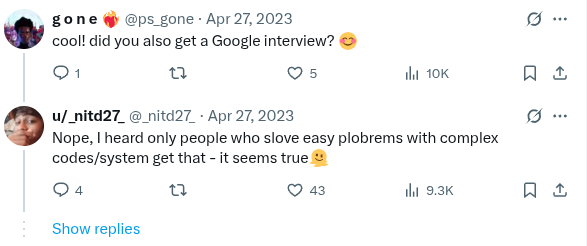

# 🦖 Self-Playing Chrome Dino Game

Automate the offline Chrome Dino game using a concise JavaScript snippet.
This script overrides the game-over behavior and makes the Dino jump automatically by detecting incoming obstacles—hands-free, endlessly running fun.


## Requirments

• Desktop

• Browser

## How to Use


1. Open chrome://dino or turn off your internet.

2. Press F12 to open DevTools.

3. Go to the Console tab.

4. Paste the following code and press Enter:
```
Runner.prototype.gameOver = function (){}
const autoPlayLoop = function() {
	const JUMP_SPEED = 50;
	const DISTANCE_BEFORE_JUMP = 120;

	const instance = window.Runner.instance_;
	const tRex = instance.tRex;

	if( tRex.jumping ) {
		requestAnimationFrame(autoPlayLoop);
		return;
	}

	const tRexPos = tRex.xPos;
	const obstacles = instance.horizon.obstacles;

	const nextObstacle = obstacles.find(o => o.xPos > tRexPos);

	if( nextObstacle && ( nextObstacle.xPos - tRexPos ) <= DISTANCE_BEFORE_JUMP ) {
		tRex.startJump(JUMP_SPEED)
	}

	requestAnimationFrame(autoPlayLoop);
}

requestAnimationFrame(autoPlayLoop);
```
## Demo


## Features
- Automatically detects and jumps over obstacles

- Overrides game-over function for endless running

- Zero external dependencies

- Just for fun and learning


# 🕰️ History

I originally kept the code to myself, but things took a turn when I replied to a tweet that was already going viral. People started asking me for the repo, and since I had shared a screenshot of the code straight from a WhatsApp text (with the worst font possible for this purpose), I figured it was time to share it properly. Back then(2 years ago), I didn’t have a repo, so I threw together a basic one just to get the code out there.

Now, after two years, I decided to give it a proper update with a better UI and more detailed info.


### Tweet


### Some Follow up tweets




### Preserved line
To download the text file of code [click here](https://github.com/nitd27/Automate-tRex/releases/tag/V1)
